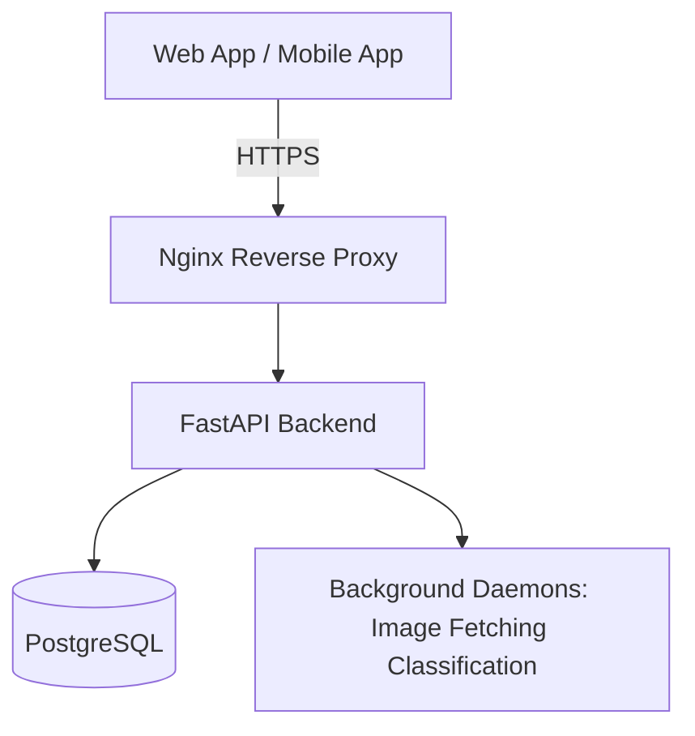
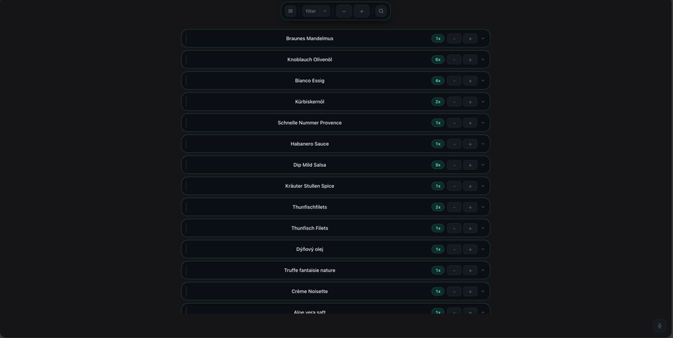
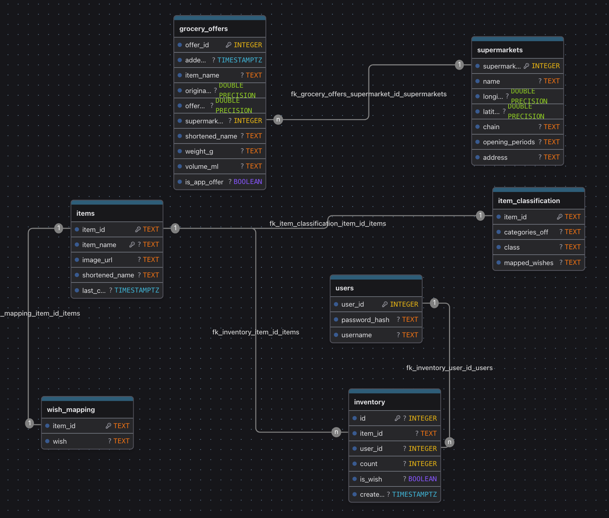

# Grocery List

Self-hosted, AI-powered grocery management app with barcode scanning, meal planning, and multilingual product classification.

🌐 **Live Demo:** https://boldo.ddns.net  

> ⚠️ Work in progress — core features are functional and self-hostable, but still evolving.

---

## ✨ Features

- **Smart Grocery List** — Track items, quantities, and categories with product images  
- **Barcode & EAN Scanning** — Fast item lookup via camera  
- **Meal Planning** — AI-assisted recipes and weekly planning  
- **Supermarket Map** — Discover nearby stores using geolocation  
- **Multilingual AI Classification** — German, English, French, Spanish  
- **LLM Usage Dashboard** — Monitor API usage at `/stats/model_usage`  
- **Self-Hosted** — Designed to run on low-cost VPS infrastructure  

---

## 📱 Mobile App

A companion **React Native (Expo)** app is included for on-the-go usage.

> Due to browser limitations, mobile devices provide a significantly more reliable scanning experience than web-based camera access.

<details>
<summary>Preview in Expo</summary>


</details>

---

## 🧠 Tech Stack

**Frontend:** React 19, TypeScript, Vite  
**Backend:** FastAPI (Python 3)  
**Database:** PostgreSQL  
**Mobile:** React Native (Expo)  
**Infra:** Docker, Nginx, background daemons  
**AI:** OpenAI-compatible endpoints  

---

## 🏗️ Architecture



Designed for **low-cost deployment**, simplicity, and full self-hosting.

---

## 🚀 Demo



---

## 📦 Project Structure

- `src/` — React frontend (Vite + Tailwind)  
- `server/` — FastAPI backend, routes, DB integration, daemons  
- `native/` — React Native (Expo) mobile app  
- `docs/` — extended documentation  

---

## ⚙️ Running Locally (Development)

### 1. Clone repository
```bash
git clone https://github.com/ninja-boldo/grocery-list.git
cd grocery-list2
```

### 2. Backend setup
```bash
pip install -r requirements.txt
# configure .env (database, API keys, etc.)
./start_server.sh
```

### 3. Frontend
```bash
bun install # or npm install
bun dev     # or npm run dev
```

### 4. Mobile App (optional)
```bash
cd native/grocery-list-scanner
bun install # or npm install
bunx expo start
```

---

## 🐳 Deployment (Production)

### One-liner (review before running)
```bash
curl -fsSL https://raw.githubusercontent.com/ninja-boldo/grocery-list-vite/mk2/pull_env.sh | bash
```

### Manual setup
```bash
git clone https://github.com/ninja-boldo/grocery-list-runner
cd grocery-list-runner

cp .env.example .env
# adjust configuration
docker compose up -d
# handle https certs
# (e.g. with certbot: https://certbot.eff.org/instructions)
```

---

## 🗄️ Database Schema



---

## ⚠️ Known Issues & Roadmap

### Bugs
- Recipe updates: some fields not persisted correctly  
- Light mode: partial styling inconsistencies  

### UX gaps
- LLM provider errors not surfaced to users  
- Item quantity/unit not fully displayed  
- Long-running classification tasks block requests  

### Planned
- Full i18n (DE, EN, FR, ES, PT, TR — work in progress)  
- Async task handling for AI pipelines  

---

## 📊 Data Sources & Attribution

This project uses open datasets and third-party services:

- **OpenStreetMap / Geofabrik**  
  Used for supermarket location data  
  License: Open Database License (ODbL 1.0)  
  © OpenStreetMap contributors  

- **Photon (Komoot)**  
  Used for geocoding (address → coordinates)  
  Based on OpenStreetMap (ODbL 1.0)  

- **Open Food Facts**  
  Used for product data, barcodes, images, nutritional information  
  License: Open Database License (ODbL 1.0)  

> If you self-host this project, you are responsible for complying with the licenses and usage policies of these services.

---

## 📚 Additional Notes

- Built as a **full-stack, self-hosted system** with focus on simplicity and cost efficiency  
- Optimized for small VPS environments  
- Designed and implemented end-to-end (frontend, backend, infra, and mobile)
