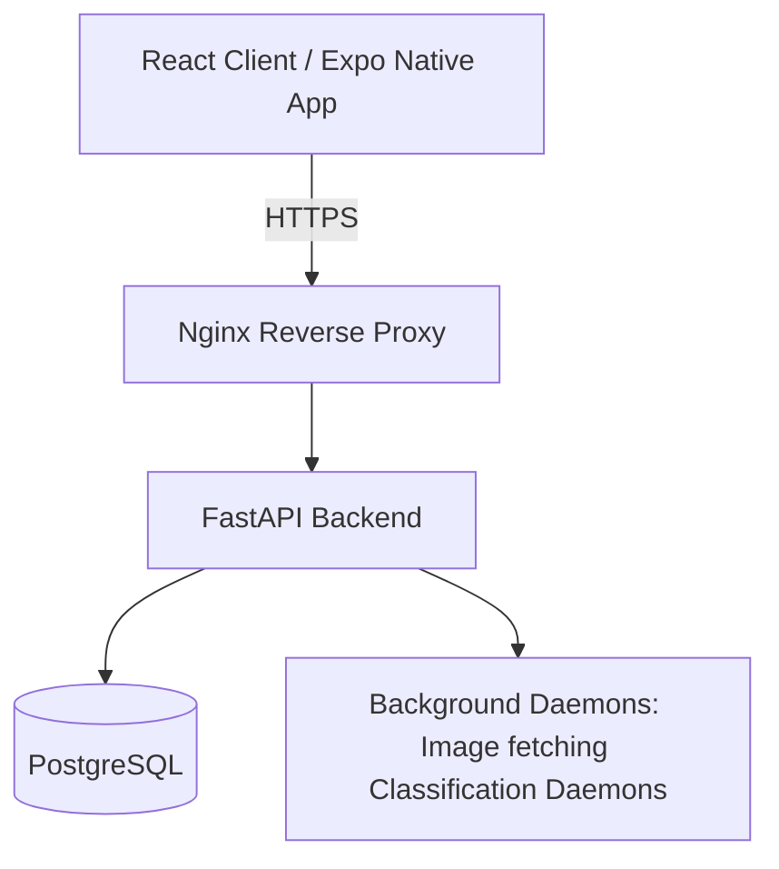

# Grocery List

A self-hosted, AI-powered grocery management app featuring a multilingual item classification pipeline, barcode scanning, meal planning, and geolocation-based supermarket discovery.

Live instance: [https://boldo.ddns.net](https://boldo.ddns.net)

> **Note:** The app is under active development. Core features are functional and self-hostable, but some rough edges remain — see [Known Issues & Roadmap](#known-issues--roadmap).

<details>
<summary>📱 See current app in Expo Go</summary>
Scan the QR code below using the Expo Go app on your phone to view the latest version of the mobile companion app connected to the live instance.


</details>


## Table of Contents
- [Features](#features)
- [Tech Stack & Architecture](#tech-stack--architecture)
- [Project Structure](#project-structure)
- [Running Locally (Development)](#running-locally-development)
- [Self-Hosting (Production)](#self-hosting-production)
- [Database Schema](#database-schema)
- [Known Issues & Roadmap](#known-issues--roadmap)
- [Third-Party Data & Licenses](#third-party-data--licenses)

---

## Features

- **Smart Grocery List** — Track quantities, map items to pantry categories, and view virtualized catalogues with product images.
- **Barcode & EAN Scanning** — Scan items instantly via device camera.
- **Supermarket Geolocation Map** — Find nearby supermarkets based on your current location.
- **Meal Planning** — Auto-generated recipe recommendations and weekly meal plans integrated with your inventory.
- **AI-Powered Item Classification** — AI pipeline for intelligent product categorisation across German, English, French, and Spanish.
- **LLM Cost Tracking** — Built-in dashboard at `/stats/model_usage` to monitor API usage and track expenses.
- **Mobile Companion App** — A dedicated React Native (Expo) app for scanning and on-the-go management.

---

## Tech Stack & Architecture

This project is a monorepo containing everything needed to run and develop the application locally.

| Layer | Technology |
| :--- | :--- |
| Frontend | React 19, TypeScript, Vite |
| Backend | FastAPI (Python 3) |
| Database | PostgreSQL |
| AI / ML | OpenAI-compatible endpoints |
| Mobile App | React Native (Expo) |
| Infra | Docker, Nginx, Background daemons (`daemons.py`) |

### Architecture Overview


The system prioritises low hosting cost, self-sustainability, and simplicity — ideal for a small VPS.

---

## Project Structure

- `src/` — React frontend codebase (Vite + Tailwind).
- `server/` — FastAPI backend, routes, database integrations, and daemon services.
- `native/grocery-list-scanner/` — React Native (Expo) mobile application.
- `docs/` — Detailed documentation regarding server API, infrastructure, and database schemas.

---

## Running Locally (Development)

### 1. Clone the repository
```bash
git clone https://github.com/ninja-boldo/grocery-list.git
cd grocery-list2
```

### 2. Setup Backend & Services
Make sure you have your Python environment and PostgreSQL database configured.
```bash
pip install -r requirements.txt
# Set up .env with database credentials
./start_server.sh
```
*(This starts both the FastAPI server and the necessary background daemons.)*

### 3. Run Frontend (Web)
```bash
bun install # or npm install
bun dev     # or npm run dev
```

### 4. Run Mobile App (Optional)
```bash
cd native/grocery-list-scanner
bun install # or npm install
bunx expo start # or npx expo start
```

---

## Self-Hosting (Production)

The easiest way to deploy is using the bootstrap script. It fetches the runner configuration, prompts you for environment details, and auto-configures HTTPS via Certbot.

> **You must have a domain name pointing to your server for HTTPS to work.**

> **One-Liner Deployment:** Only run this if you have reviewed the script and understand what it does.
> ```bash
> curl -fsSL https://raw.githubusercontent.com/ninja-boldo/grocery-list-vite/mk2/pull_env.sh | bash
> ```

### Manual Deployment
```bash
git clone https://github.com/ninja-boldo/grocery-list-runner
cd grocery-list-runner

cp .env.example .env
# Edit .env to fit your configuration
docker compose up -d
```

The application will then be available on your domain or `http://localhost`.

---

## Database Schema


---

## Known Issues & Roadmap

The core application is functional and self-hostable. The following are known limitations currently being worked on:

### Bugs
- Recipe update endpoint: some fields are not persisted correctly on `PATCH`
- Light mode: partial styling bleed from the dark mode theme

### UX gaps
- LLM provider errors (rate limits, timeouts) are not yet surfaced to the user
- Item quantity and unit info from manual entry is not displayed in the UI
- Long-running classification tasks block the request rather than being dispatched as a detached background task — noticeable with slower providers

### Planned
- Full i18n across all supported locales (German, English, French, Spanish, Portuguese, Turkish) — currently a work in progress with mixed coverage

---

## Third-Party Data & Licenses

<details>
<summary>Attributions & Usage Policies</summary>

This app makes use of open data from several third-party sources. If you plan to self-host this application, please review the original source licenses and usage policies directly to ensure compliance.

### OpenStreetMap & Geofabrik
- Used for: Supermarket location data
- Source: [download.geofabrik.de](https://download.geofabrik.de/)
- Upstream license: [Open Database License (ODbL) 1.0](https://opendatacommons.org/licenses/odbl/1-0/)
- Note: © OpenStreetMap contributors. The bundled supermarket dataset (`europe-supermarkets.parquet`) is derived from Geofabrik.

### Photon (Komoot)
- Used for: Geocoding (address → coordinates)
- Source: [photon.komoot.io](https://photon.komoot.io)
- Underlying license: [Open Database License (ODbL) 1.0](https://opendatacommons.org/licenses/odbl/1-0/)
- Usage policy: [komoot.com/terms](https://www.komoot.com/terms)
- Note: Consider running your own Photon instance if self-hosting at scale.

### Open Food Facts
- Used for: Product info, EAN barcodes, nutritional data, images
- Source: [world.openfoodfacts.org](https://world.openfoodfacts.org)
- License: [Open Database License (ODbL) 1.0](https://opendatacommons.org/licenses/odbl/1-0/)

Note for self-hosters: You are responsible for ensuring your usage of all third-party data and APIs complies with their respective licenses.
</details>